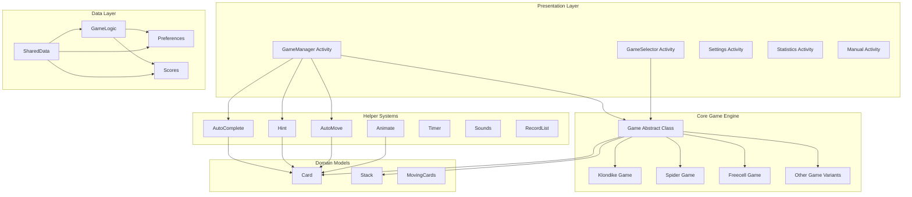
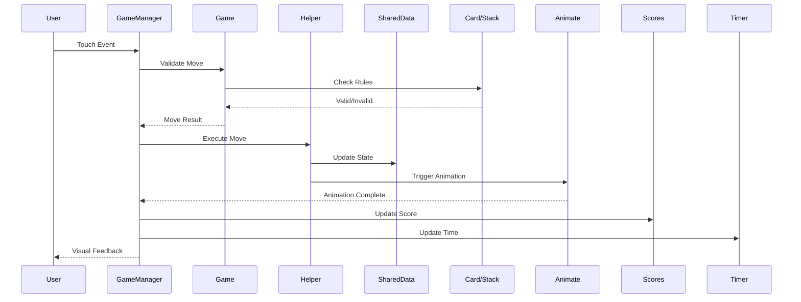

# Solitaire Collection

A comprehensive Android application featuring a collection of 19+ classic Solitaire card game variants with rich customization options, smooth animations, and intelligent gameplay assistance.

## Introduction

Solitaire Collection is a feature-rich Android application that brings together classic card games in a modern, intuitive interface. Built with Java and the Android SDK, this application offers an extensive collection of solitaire variants ranging from popular games like Klondike and Spider to lesser-known variants like Grandfather's Clock and Napoleon's Tomb.

The application emphasizes user experience through smooth animations, intelligent hint systems, comprehensive statistics tracking, and extensive customization options. Whether you are a casual player or a solitaire enthusiast, this collection provides hours of engaging gameplay with automatic save states and progressive difficulty options.

## Key Features

### Game Collection

- **19+ Solitaire Variants**: Including Klondike, Vegas, Spider, Spiderette, Freecell, Yukon, Pyramid, TriPeaks, Golf, Gypsy, Forty-Eight, Aces Up, Canfield, Calculation, Simple Simon, Grandfather's Clock, Maze, Mod3, and Napoleon's Tomb
- **Game-Specific Rules**: Each variant implements authentic rules and scoring systems
- **Multiple Difficulty Levels**: Configurable difficulty settings for games like Spider (1-4 suits)
- **Draw Options**: Customizable draw modes (Draw 1 or Draw 3 for Klondike/Vegas)

### Gameplay Features

- **Intelligent Hint System**: Context-aware hints that guide players through challenging situations
- **Undo/Redo Functionality**: Unlimited undo with optional scoring penalties
- **Auto-Complete**: Three-phase auto-complete system that finishes winnable games automatically
- **Drag-and-Drop Interface**: Smooth, intuitive card movement with multi-card selection
- **Double-Tap Actions**: Quick card placement to foundation stacks
- **Auto-Move**: Automatic card movement for obvious plays

### User Experience

- **Automatic Save States**: Game progress persists across sessions
- **Statistics Tracking**: Comprehensive statistics including win percentage, time played, points earned, hints used, and undo count
- **High Score System**: Track and display best performances per game
- **Customizable Themes**: Multiple card designs, backgrounds, and color schemes
- **Four-Color Deck Mode**: Enhanced visibility with distinct suit colors
- **Sound Effects**: Optional audio feedback with volume control
- **Immersive Mode**: Full-screen gameplay option

### Customization Options

- **Visual Customization**:

  - Multiple card back designs
  - Custom background colors
  - Adjustable text colors
  - Game layout margin controls
  - Menu bar positioning (top/bottom)

- **Gameplay Customization**:
  - Single tap or tap-to-select modes
  - Left-handed mode support
  - Configurable auto-move behavior
  - Adjustable recycling limits
  - Ensure movability options with minimum moves

### Technical Features

- **Efficient Memory Management**: Static bitmap caching for optimal performance
- **Smooth Animations**: Hardware-accelerated animations using ObjectAnimator
- **State Persistence**: Comprehensive save/restore functionality
- **Locale Support**: Multi-language capability through resource localization
- **Material Design**: Modern UI following Material Design guidelines

## Overall Architecture

The application follows a modular, object-oriented architecture designed for extensibility and maintainability.

### Architectural Diagram



### Core Components

#### 1. Game Engine (`games/`)

**Abstract Base Class Pattern**:

- `Game.java`: Abstract base class defining the contract for all game variants
- Each game variant extends `Game` and implements game-specific logic
- Provides template methods for:
  - `setStacks()`: Layout configuration
  - `dealCards()`: Initial card distribution
  - `cardTest()`: Move validation
  - `hintTest()`: Hint generation
  - `autoCompleteStartTest()`: Auto-complete eligibility
  - `winTest()`: Victory conditions
  - `addPointsToScore()`: Scoring logic

**Game Variants**:
All games inherit from the base `Game` class and override specific methods to implement their unique rules and behaviors.

#### 2. UI Layer (`ui/`)

**Activities**:

- `GameManager`: Main gameplay activity handling touch events, card movements, and game state
- `GameSelector`: Game selection menu with customizable grid layout
- `Settings`: Comprehensive settings management with preference fragments
- `Statistics`: Statistical data visualization and high score displays
- `Manual`: In-app help system with game rules and UI guidance
- `AboutActivity`: Application information, licenses, and changelog

**Custom Components**:

- Custom preference classes for per-game settings
- Dialog fragments for user interactions
- Specialized layouts for different screen orientations

#### 3. Helper Systems (`helper/`)

**Movement and Animation**:

- `Animate`: Manages card animations using ObjectAnimator
- `AutoMove`: Automated card movement for obvious plays
- `MovingCards`: Handles drag-and-drop card operations
- `DealCards`: Card distribution logic

**Gameplay Assistance**:

- `Hint`: Intelligent hint generation system
- `AutoComplete`: Three-phase auto-completion logic
- `EnsureMovability`: Validates game solvability

**Game Management**:

- `GameLogic`: Core game flow and state management
- `RecordList`: Undo/redo system with move history
- `Timer`: Game time tracking
- `Scores`: Scoring system and statistics tracking

**Persistence and Configuration**:

- `Preferences`: SharedPreferences wrapper for settings management
- `Bitmaps`: Bitmap caching and card rendering
- `Sounds`: Audio feedback system
- `BackgroundMusic`: Background audio management

#### 4. Data Models (`classes/`)

- `Card`: Represents individual playing cards with properties and behaviors
- `Stack`: Manages collections of cards with stack-specific rules
- `CardAndStack`: Utility class pairing cards with destination stacks
- `CustomAppCompatActivity`: Base activity with common functionality
- `WaitForAnimationHandler`: Synchronizes operations with animations

#### 5. Shared Data Layer

`SharedData.java`: Centralized static container for:

- Game state references
- Helper system instances
- Global configuration
- Utility methods

### Data Flow



### Design Patterns

1. **Template Method Pattern**: `Game` abstract class defines skeleton, subclasses implement specific steps
2. **Strategy Pattern**: Different scoring, validation, and hint strategies per game variant
3. **Observer Pattern**: Callbacks for score updates, timer ticks, and state changes
4. **Singleton Pattern**: `SharedData` provides global access to shared resources
5. **Factory Pattern**: `LoadGame` creates appropriate game instances
6. **State Pattern**: Game state management (playing, won, paused)
7. **Command Pattern**: `RecordList` for undo/redo functionality

## Installation

### Prerequisites

- **Android Studio**: Arctic Fox (2020.3.1) or later
- **Java Development Kit (JDK)**: Version 11 or higher
- **Android SDK**: API Level 33 (minimum) to 36 (target)
- **Gradle**: Version 8.12.3 or higher (managed by wrapper)

### Clone Repository

```bash
git clone <repository-url>
cd solitaire
```

### Sync Dependencies

1. Open the project in Android Studio
2. Allow Gradle sync to complete automatically
3. Dependencies are managed via `gradle/libs.versions.toml`

### Key Dependencies

```toml
[versions]
agp = "8.12.3"
appcompat = "1.7.1"
material = "1.13.0"
constraintlayout = "2.2.1"
ambilwarna = "2.0.1"        # Color picker
viewpager2 = "1.1.0"
runtime = "1.9.4"

[libraries]
appcompat = { group = "androidx.appcompat", name = "appcompat", version.ref = "appcompat" }
material = { group = "com.google.android.material", name = "material", version.ref = "material" }
constraintlayout = { group = "androidx.constraintlayout", name = "constraintlayout", version.ref = "constraintlayout" }
ambilwarna = { module = "com.github.yukuku:ambilwarna", version.ref = "ambilwarna" }
viewpager2 = { module = "androidx.viewpager2:viewpager2", version.ref = "viewpager2" }
runtime = { group = "androidx.compose.runtime", name = "runtime", version.ref = "runtime" }
```

## Running the Project

### Development Build

#### Via Android Studio

1. Connect an Android device or start an emulator
2. Select the device from the device dropdown
3. Click the Run button (green triangle) or press `Shift + F10`

#### Via Command Line

```bash
# Debug build
./gradlew installDebug

# Run on connected device
adb shell am start -n vn.edu.fpt.solitaire/.ui.GameSelector
```

### Release Build

```bash
# Generate unsigned APK
./gradlew assembleRelease

# Generate signed APK (requires keystore configuration)
./gradlew assembleRelease -Pandroid.injected.signing.store.file=<keystore_path> \
    -Pandroid.injected.signing.store.password=<store_password> \
    -Pandroid.injected.signing.key.alias=<key_alias> \
    -Pandroid.injected.signing.key.password=<key_password>
```

Output location: `app/build/outputs/apk/release/app-release.apk`

### Testing

```bash
# Run unit tests
./gradlew test

# Run instrumented tests
./gradlew connectedAndroidTest

# Generate test coverage report
./gradlew createDebugCoverageReport
```

## Environment Configuration

### Build Configuration

Edit `app/build.gradle.kts`:

```kotlin
android {
    namespace = "vn.edu.fpt.solitaire"
    compileSdk = 36

    defaultConfig {
        applicationId = "vn.edu.fpt.solitaire"
        minSdk = 33
        targetSdk = 36
        versionCode = 1
        versionName = "1.0"
    }

    buildTypes {
        release {
            isMinifyEnabled = false
            proguardFiles(
                getDefaultProguardFile("proguard-android-optimize.txt"),
                "proguard-rules.pro"
            )
        }
    }
}
```

### Gradle Properties

Edit `gradle.properties` for build optimization:

```properties
# Memory allocation
org.gradle.jvmargs=-Xmx2048m -Dfile.encoding=UTF-8

# AndroidX migration
android.useAndroidX=true
android.nonTransitiveRClass=true

# Build performance
org.gradle.parallel=true
org.gradle.caching=true
```

### ProGuard Configuration

Edit `app/proguard-rules.pro` for release optimization:

```proguard
# Keep game classes for reflection
-keep class vn.edu.fpt.solitaire.games.** { *; }

# Keep custom view classes
-keep class vn.edu.fpt.solitaire.classes.** { *; }

# Preserve animations
-keepclassmembers class * {
    public void set*(***);
    public *** get*();
}
```

### Local Properties

Create `local.properties` for SDK path:

```properties
sdk.dir=C\:\\Users\\<username>\\AppData\\Local\\Android\\Sdk
```

### Signing Configuration

For release builds, create `keystore.properties`:

```properties
storeFile=path/to/keystore.jks
storePassword=your_store_password
keyAlias=your_key_alias
keyPassword=your_key_password
```

## Folder Structure

```
solitaire/
├── app/                                    # Application module
│   ├── src/
│   │   ├── main/
│   │   │   ├── java/vn/edu/fpt/solitaire/
│   │   │   │   ├── checkboxpreferences/  # Custom checkbox preferences
│   │   │   │   ├── classes/              # Core data models
│   │   │   │   │   ├── Card.java
│   │   │   │   │   ├── Stack.java
│   │   │   │   │   ├── CardAndStack.java
│   │   │   │   │   ├── CustomAppCompatActivity.java
│   │   │   │   │   └── ...
│   │   │   │   ├── dialogs/              # Custom dialog implementations
│   │   │   │   ├── games/                # Game variant implementations
│   │   │   │   │   ├── Game.java         # Abstract base class
│   │   │   │   │   ├── Klondike.java
│   │   │   │   │   ├── Spider.java
│   │   │   │   │   ├── Freecell.java
│   │   │   │   │   └── ...               # 19+ game variants
│   │   │   │   ├── handler/              # Custom handlers
│   │   │   │   ├── helper/               # Helper systems
│   │   │   │   │   ├── Animate.java
│   │   │   │   │   ├── AutoComplete.java
│   │   │   │   │   ├── Hint.java
│   │   │   │   │   ├── AutoMove.java
│   │   │   │   │   ├── GameLogic.java
│   │   │   │   │   ├── RecordList.java
│   │   │   │   │   ├── Scores.java
│   │   │   │   │   ├── Timer.java
│   │   │   │   │   ├── Preferences.java
│   │   │   │   │   └── ...
│   │   │   │   ├── ui/                   # UI components
│   │   │   │   │   ├── about/           # About activity fragments
│   │   │   │   │   ├── manual/          # Help system fragments
│   │   │   │   │   ├── settings/        # Settings fragments
│   │   │   │   │   ├── statistics/      # Statistics fragments
│   │   │   │   │   ├── GameManager.java # Main gameplay activity
│   │   │   │   │   └── GameSelector.java# Game selection activity
│   │   │   │   ├── LoadGame.java        # Game loader factory
│   │   │   │   ├── MainApplication.java # Application class
│   │   │   │   └── SharedData.java      # Global shared data
│   │   │   ├── res/                      # Resources
│   │   │   │   ├── anim/                # Animation definitions
│   │   │   │   ├── animator/            # Animator resources
│   │   │   │   ├── drawable/            # Vector drawables
│   │   │   │   ├── drawable-nodpi/      # Card image assets
│   │   │   │   ├── layout/              # Layout XML files
│   │   │   │   ├── layout-land/         # Landscape layouts
│   │   │   │   ├── menu/                # Menu definitions
│   │   │   │   ├── mipmap-*/            # Launcher icons
│   │   │   │   ├── raw/                 # Sound files
│   │   │   │   ├── values/              # String, colors, styles
│   │   │   │   ├── values-night/        # Dark theme resources
│   │   │   │   └── xml/                 # Preferences, backup rules
│   │   │   └── AndroidManifest.xml
│   │   ├── androidTest/                  # Instrumented tests
│   │   └── test/                         # Unit tests
│   ├── build.gradle.kts                  # App-level build configuration
│   └── proguard-rules.pro                # ProGuard rules
├── gradle/                               # Gradle wrapper and configuration
│   ├── libs.versions.toml                # Centralized dependency versions
│   └── wrapper/
│       ├── gradle-wrapper.jar
│       └── gradle-wrapper.properties
├── build.gradle.kts                      # Project-level build configuration
├── settings.gradle.kts                   # Project settings
├── gradle.properties                     # Gradle properties
├── gradlew                               # Gradle wrapper (Unix)
├── gradlew.bat                           # Gradle wrapper (Windows)
└── README.md                             # This file
```

### Key Directory Descriptions

- **checkboxpreferences/**: Custom checkbox preference implementations for per-game settings
- **classes/**: Core domain models (Card, Stack) and base activity classes
- **dialogs/**: Custom dialog implementations for user interactions
- **games/**: All solitaire game variants extending the base Game class
- **helper/**: Support systems for gameplay (hints, animations, scoring, undo/redo)
- **ui/**: Activities and fragments for user interface
- **res/**: Android resources including layouts, drawables, strings, and styles

## Contribution Guidelines

We welcome contributions to improve Solitaire Collection. Please follow these guidelines:

### Getting Started

1. Fork the repository
2. Create a feature branch: `git checkout -b feature/your-feature-name`
3. Set up your development environment following the Installation section

### Code Standards

#### Java Code Style

- Follow standard Java naming conventions
- Use meaningful variable and method names
- Maximum line length: 120 characters
- Indentation: 4 spaces (no tabs)
- Always use braces for control structures, even single-line blocks

```java
// Good
if (condition) {
    doSomething();
}

// Avoid
if (condition) doSomething();
```

#### Documentation

- Add JavaDoc comments for all public classes and methods
- Document complex algorithms and business logic
- Update README.md for user-facing changes

```java
/**
 * Tests if a card can be placed on the specified stack.
 *
 * @param stack The destination stack
 * @param card The card to test
 * @return true if the move is valid, false otherwise
 */
public boolean cardTest(Stack stack, Card card) {
    // Implementation
}
```

#### Android Best Practices

- Use ViewBinding instead of findViewById
- Avoid memory leaks (use WeakReference for callbacks)
- Handle configuration changes properly
- Use resource files for strings, dimensions, and colors
- Support both portrait and landscape orientations

### Adding a New Game Variant

1. Create a new class in `games/` extending `Game`
2. Override required abstract methods
3. Implement game-specific logic
4. Add game entry in `LoadGame.java`
5. Add string resources for game name and manual
6. Create layout if custom UI is needed
7. Add manual documentation
8. Write unit tests

Example skeleton:

```java
public class NewGame extends Game {

    public NewGame() {
        // Configure number of decks, stacks, etc.
        setNumberOfDecks(1);
        setNumberOfStacks(16);
        setTableauStackIDs(0, 1, 2, 3, 4, 5, 6);
        setFoundationStackIDs(7, 8, 9, 10);
    }

    @Override
    public void setStacks(RelativeLayout layoutGame, boolean isLandscape, Context context) {
        // Stack positioning and configuration
    }

    @Override
    public boolean cardTest(Stack stack, Card card) {
        // Move validation logic
        return false;
    }

    @Override
    public boolean winTest() {
        // Victory condition
        return false;
    }

    // Override other methods as needed
}
```

### Testing

- Write unit tests for new game logic
- Test on multiple screen sizes and orientations
- Verify save/restore state functionality
- Test edge cases and unusual move sequences

```bash
# Run tests before submitting
./gradlew test
./gradlew connectedAndroidTest
```

### Commit Guidelines

Follow conventional commit format:

```
<type>(<scope>): <subject>

<body>

<footer>
```

Types:

- `feat`: New feature
- `fix`: Bug fix
- `docs`: Documentation changes
- `style`: Code style changes (formatting, no logic change)
- `refactor`: Code refactoring
- `perf`: Performance improvements
- `test`: Adding or updating tests
- `chore`: Build process or auxiliary tool changes

Example:

```
feat(games): add Pyramid Solitaire variant

Implement Pyramid game with scoring system and hint logic.
Add manual documentation and resource strings.

Closes #123
```

### Pull Request Process

1. Update documentation for any user-facing changes
2. Ensure all tests pass
3. Update CHANGELOG.md if applicable
4. Request review from maintainers
5. Address review feedback promptly
6. Squash commits before merge if requested

### Pull Request Template

```markdown
## Description

Brief description of changes

## Type of Change

- [ ] Bug fix
- [ ] New feature
- [ ] Breaking change
- [ ] Documentation update

## Checklist

- [ ] Code follows project style guidelines
- [ ] Self-review completed
- [ ] Comments added for complex logic
- [ ] Documentation updated
- [ ] No new warnings generated
- [ ] Tests added/updated and passing
- [ ] Manual testing on physical device
```

---

**Note**: This is an educational project developed as part of mobile development coursework. For questions or suggestions, please open an issue or submit a pull request.
